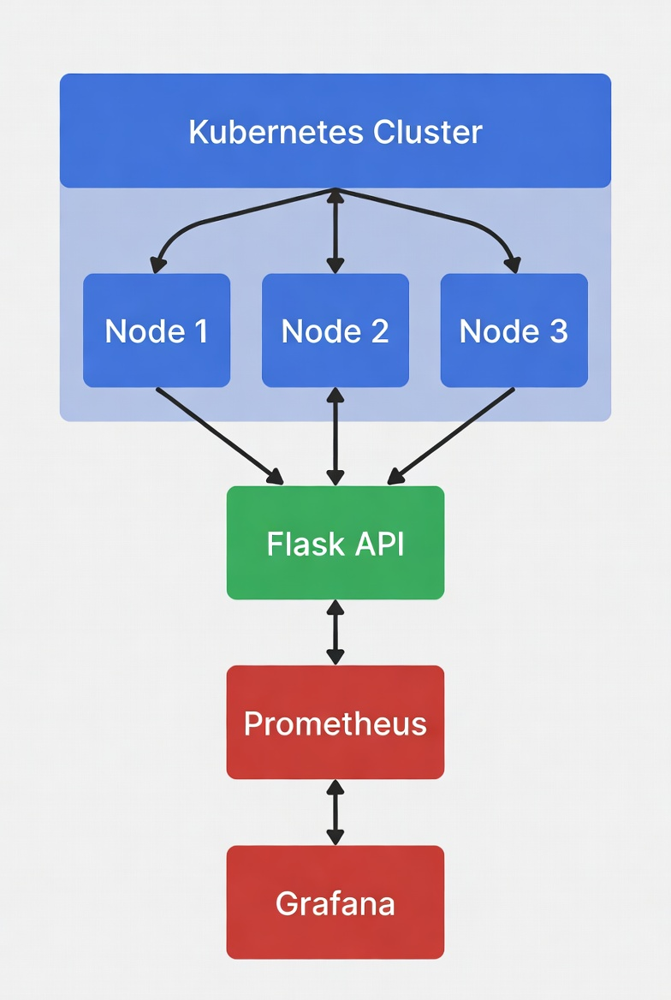
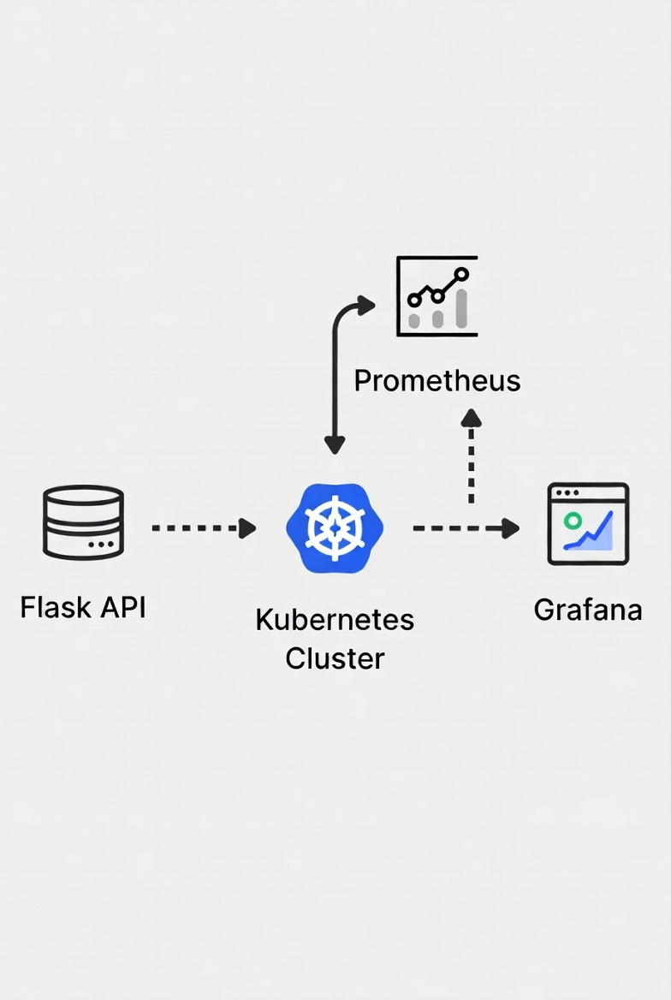

# Pipeline DevOps Completa: API + Kubernetes + Monitoramento

<p align="center">
  
  
  
</p>

**Projeto de portfólio que demonstra o ciclo completo de uma aplicação moderna em produção (localmente).**  
Uma API simples em Python + deploy automatizado em Kubernetes + monitoramento real com Prometheus e Grafana.

> "Queria mostrar que consigo levar uma aplicação do código até o monitoramento em produção — tudo documentado e reproduzível."

### O que este projeto entrega (em 30 segundos)

- Uma API REST em Flask (Python)
- Containerizada com **Docker**
- Orquestrada localmente com **Kubernetes** (usando Minikube)
- Monitorada de verdade com **Prometheus** + **Grafana** (dashboards bonitos!)
- Health check e métricas expostas para observabilidade
- Estrutura profissional de pastas e manifests claros

### Visão geral da arquitetura

<p align="center">
  
</p>


<p align="center">
  
</p>

```
Cliente (browser / curl)  
       ↓
Kubernetes Service (LoadBalancer)
       ↓
Pods → Flask API (container Docker)
       ↓
Prometheus coleta métricas (/metrics)
       ↓
Grafana mostra gráficos bonitos
```

### 🛠️ Tecnologias & Ferramentas (stack)

| Categoria        | Ferramenta       | Por que usei?                              |
|------------------|------------------|---------------------------------------------|
| Linguagem        | Python + Flask   | API leve e rápida de criar                  |
| Container        | Docker           | Padroniza o ambiente de execução            |
| Orquestração     | Kubernetes       | Padrão da indústria para produção           |
| Cluster local    | Minikube         | Permite testar K8s na minha máquina         |
| Monitoramento    | Prometheus       | Coleta métricas da aplicação                |
| Visualização     | Grafana          | Dashboards intuitivos e bonitos             |

### Como rodar o projeto (passo a passo simples)

**Pré-requisitos**  
- Docker instalado  
- Minikube instalado e rodando (`minikube start`)  
- kubectl instalado

1. Clone o repositório
   ```bash
   git clone https://github.com/SEU_USUARIO/devops-cicd-project.git
   cd devops-cicd-project
   ```

2. Construa e carregue a imagem no Minikube
   ```bash
   docker build -t devops-api .
   minikube image load devops-api
   ```

3. Faça o deploy da aplicação
   ```bash
   kubectl apply -f k8s/
   ```

4. (Opcional, mas recomendo) Deploy do monitoramento
   ```bash
   kubectl apply -f monitoring/
   ```

5. Abra a API no navegador
   ```bash
   minikube service devops-api-service
   ```
   Endpoints legais:
   - http://IP:PORT/          → "Hello from DevOps!"
   - http://IP:PORT/health    → Status da aplicação
   - http://IP:PORT/metrics   → Métricas para o Prometheus

6. Abra o Grafana e veja as métricas bonitas
   ```bash
   minikube service grafana-service
   ```
   - Usuário/senha padrão: **admin / admin**  
   - Adicione o Prometheus como fonte: `http://prometheus-service:9090`  
   - Query de exemplo: `app_requests_total`

### Resultados que você pode ver

- Contador de requisições crescendo em tempo real no Grafana
- Gráficos de taxa de requisições por segundo
- Health check funcionando (útil em produção!)
- Pods rodando saudáveis no Kubernetes

### Habilidades DevOps que este projeto demonstra

- Containerização e boas práticas com Docker  
- Escrita e organização de manifests Kubernetes  
- Configuração de Service, Deployment  
- Implementação de observabilidade (métricas customizadas)  
- Integração Prometheus + aplicação  
- Criação e uso de dashboards no Grafana  
- Documentação clara e reproduzível  
- Estrutura de projeto profissional  

Se você chegou até aqui: **obrigado por olhar meu trabalho!**  
Qualquer dúvida, sugestão ou feedback é super bem-vindo.  
Pode abrir issue ou me chamar no LinkedIn / X.